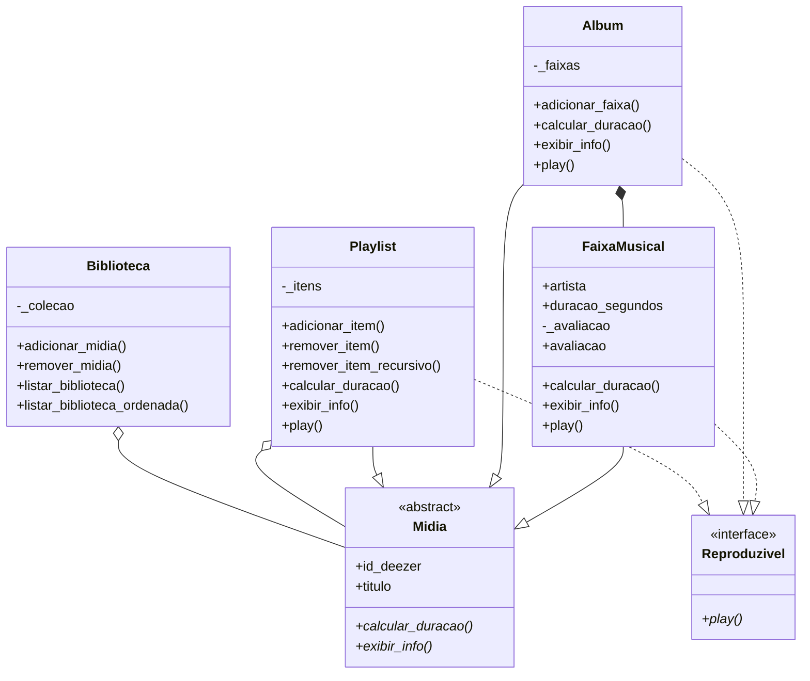

# Projeto-Software-2026.2

## Implementações Recentes

O projeto foi refatorado e modularizado para aplicar os conceitos de Programação Orientada a Objetos exigidos na especificação.

### Estrutura do Projeto
* **`modelos.py`**: Contém as classes do domínio musical.
* **`api.py`**: Gerencia a comunicação com a API da Deezer.
* **`main.py`**: Roda o menu interativo no terminal.

### Conceitos de POO Aplicados
* **Abstração e Herança (RF3)**: Criamos a classe abstrata `Midia` servindo de molde para `FaixaMusical`, `Album` e `Playlist`.
* **Interface / Abstração (RF4)**: A classe abstrata `Reproduzivel` define o contrato `play()`, implementado por `FaixaMusical`, `Album` e `Playlist`. O `simular_player()` do menu verifica `isinstance(midia, Reproduzivel)` antes de tentar reproduzir qualquer item.
* **Encapsulamento (RF1 e RF2)**: As notas das músicas e a coleção da biblioteca são atributos privados (`_avaliacao`, `_colecao`). O acesso e a alteração são controlados (ex: barrando notas inválidas e duplicatas).
* **Polimorfismo (RF3)**: O cálculo de duração e a exibição de informações funcionam para qualquer item da biblioteca, já que cada classe filha sobrescreve os métodos `calcular_duracao()` e `exibir_info()` com sua própria lógica.
* **Agregação**: Álbuns contêm faixas, e Playlists contêm álbuns, faixas ou outras playlists, conectando os objetos do sistema.

### Requisitos Não Funcionais Aplicados
* **RF7 — Resultado vazio como condição normal**: Uma busca sem resultados na API (ex: `asdkjhqwe`) não gera erro nem trava o programa. `api.py` sempre retorna `None`/`(None, None)` de forma controlada, e `main.py` exibe uma mensagem amigável ("Nenhum resultado encontrado — tente outra grafia") e continua a execução normalmente.
* **RF8 — Fonte de dados oculta**: `main.py` não conhece mais o Deezer diretamente. `api.py` expõe apenas as funções genéricas `buscar_faixa()` e `buscar_album()`; a implementação específica do Deezer (`_buscar_faixa_deezer`, `_buscar_album_deezer`) fica encapsulada dentro do próprio arquivo. Se a fonte de dados mudar no futuro (ex: para o MusicBrainz), apenas `api.py` precisa ser alterado.
* **RF9 — Remoção consistente**: `Biblioteca.remover_midia()` remove um item da biblioteca e também de todas as playlists (incluindo sub-playlists aninhadas) que o referenciam, usando `Playlist.remover_item_recursivo()`. Política adotada: remoção em cascata, sem deixar referências quebradas; o usuário é avisado de quantas playlists foram afetadas.
* **RF10 — Ordenação extensível**: `Biblioteca.listar_biblioteca_ordenada()` ordena a coleção por qualquer critério registrado no dicionário `CRITERIOS_ORDENACAO` (`titulo`, `duracao`, `avaliacao`). Novos critérios podem ser adicionados via `registrar_criterio_ordenacao()` sem alterar o método de ordenação já existente.

*Diagrama de classes*

