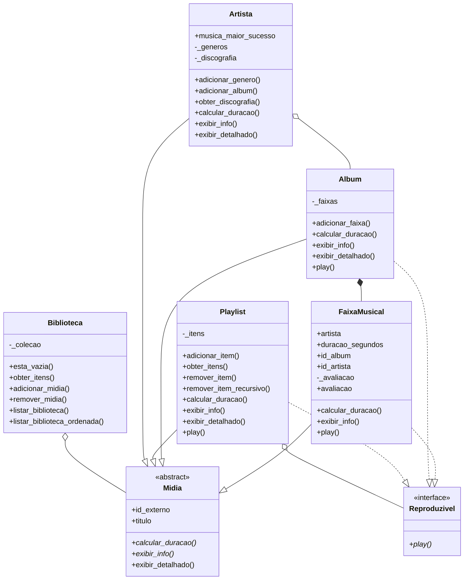

# Projeto-Software-2026.2

## Implementações Recentes

O projeto foi refatorado e modularizado para aplicar os conceitos de Programação Orientada a Objetos exigidos na especificação.

### Estrutura do Projeto
* **`modelos.py`**: Contém as classes do domínio musical.
* **`api.py`**: Gerencia a comunicação com a fonte de dados musicais ativa — Deezer, iTunes ou MusicBrainz, selecionável por uma única variável (`PROVEDOR_ATUAL`).
* **`main.py`**: Roda o menu interativo no terminal.

### Conceitos de POO Aplicados
* **Abstração e Herança (RF3)**: Criamos a classe abstrata `Midia` servindo de molde para `FaixaMusical`, `Album`, `Playlist` e `Artista`.
* **Interface / Abstração (RF4)**: A classe abstrata `Reproduzivel` define o contrato `play()`, implementado por `FaixaMusical`, `Album` e `Playlist` — mas **não** por `Artista`, que é uma `Midia` propositalmente não reproduzível. O `simular_player()` do menu verifica `isinstance(midia, Reproduzivel)` antes de tentar reproduzir qualquer item, e `Playlist.adicionar_item()` usa a mesma checagem para recusar estruturalmente qualquer item não reproduzível (como um `Artista`).
* **Encapsulamento (RF1 e RF2)**: A avaliação de uma faixa (`_avaliacao`) só aceita números **inteiros** de 0 a 5 — floats e valores fora do intervalo são rejeitados no setter. A coleção da biblioteca (`_colecao`) é um atributo privado; `Biblioteca` expõe `esta_vazia()` e `obter_itens()` (que devolve uma cópia da lista) para que nenhum código externo precise ler ou modificar esse dicionário diretamente.
* **Polimorfismo (RF3)**: O cálculo de duração e a exibição de informações funcionam para qualquer item da biblioteca, já que cada classe filha sobrescreve os métodos `calcular_duracao()`, `exibir_info()` e `exibir_detalhado()` com sua própria lógica.
* **Agregação e Composição**: Álbuns contêm faixas em composição (`_faixas`, criadas e pertencentes exclusivamente ao álbum); Playlists contêm, em agregação, qualquer item reproduzível (faixas, álbuns ou outras playlists); Artistas contêm, em agregação, os álbuns de sua discografia (`_discografia`).

### Requisitos Não Funcionais Aplicados
* **RF7 — Resultado vazio como condição normal**: Uma busca sem resultados na API (ex: `asdkjhqwe`), ou qualquer falha de rede (incluindo limite de requisições do MusicBrainz), não gera erro nem trava o programa. `api.py` sempre retorna `[]`/`None` de forma controlada, e `main.py` exibe uma mensagem amigável e continua a execução normalmente.
* **RF8 — Fonte de dados oculta**: `main.py` não conhece qual fonte está ativa. `api.py` expõe apenas as funções genéricas `buscar_faixas()`, `buscar_album()`, `buscar_artista()` e `nome_provedor_atual()`; as implementações específicas de cada fonte (`_buscar_faixas_deezer`, `_buscar_faixas_itunes`, `_buscar_faixas_musicbrainz`, e equivalentes para álbum/artista) ficam encapsuladas dentro do próprio arquivo, cada uma escondida atrás do prefixo `_`. Trocar de fonte, ou adicionar uma nova, exige mudanças só em `api.py` — hoje isso já é uma realidade, não uma possibilidade futura: o projeto tem três fontes reais e intercambiáveis.
* **RF9 — Remoção consistente**: `Biblioteca.remover_midia()` remove um item da biblioteca e também de todas as playlists (incluindo sub-playlists aninhadas) que o referenciam, usando `Playlist.remover_item_recursivo()`. Política adotada: remoção em cascata, sem deixar referências quebradas; o usuário é avisado de quantas playlists foram afetadas. Também é possível remover um componente específico de dentro de uma playlist (sem apagar a playlist inteira), descendo recursivamente por sub-playlists até o item certo.
* **RF10 — Ordenação extensível**: `Biblioteca.listar_biblioteca_ordenada()` ordena a coleção por qualquer critério registrado no dicionário `CRITERIOS_ORDENACAO` (`titulo`, `duracao`, `avaliacao`, por padrão). Novos critérios podem ser adicionados via `registrar_criterio_ordenacao()` (que recusa sobrescrever um nome já existente) e removidos via `remover_criterio_ordenacao()`, sem alterar o método de ordenação já existente. O menu tem uma tela dedicada (opção 12) para adicionar/remover critérios interativamente, sem precisar editar código.

*Diagrama de classes*

```mermaid
classDiagram
    class Midia {
        <<abstract>>
        +id_externo
        +titulo
        +calcular_duracao()*
        +exibir_info()*
        +exibir_detalhado()
    }
    class Reproduzivel {
        <<interface>>
        +play()*
    }
    class FaixaMusical {
        +artista
        +duracao_segundos
        +id_album
        +id_artista
        -_avaliacao
        +avaliacao
        +calcular_duracao()
        +exibir_info()
        +play()
    }
    class Album {
        -_faixas
        +adicionar_faixa()
        +calcular_duracao()
        +exibir_info()
        +exibir_detalhado()
        +play()
    }
    class Playlist {
        -_itens
        +adicionar_item()
        +obter_itens()
        +remover_item()
        +remover_item_recursivo()
        +calcular_duracao()
        +exibir_info()
        +exibir_detalhado()
        +play()
    }
    class Artista {
        +musica_maior_sucesso
        -_generos
        -_discografia
        +adicionar_genero()
        +adicionar_album()
        +obter_discografia()
        +calcular_duracao()
        +exibir_info()
        +exibir_detalhado()
    }
    class Biblioteca {
        -_colecao
        +esta_vazia()
        +obter_itens()
        +adicionar_midia()
        +remover_midia()
        +listar_biblioteca()
        +listar_biblioteca_ordenada()
    }

    FaixaMusical --|> Midia
    Album --|> Midia
    Playlist --|> Midia
    Artista --|> Midia
    FaixaMusical ..|> Reproduzivel
    Album ..|> Reproduzivel
    Playlist ..|> Reproduzivel

    Album *-- FaixaMusical
    Playlist o-- Reproduzivel
    Artista o-- Album
    Biblioteca o-- Midia
```
